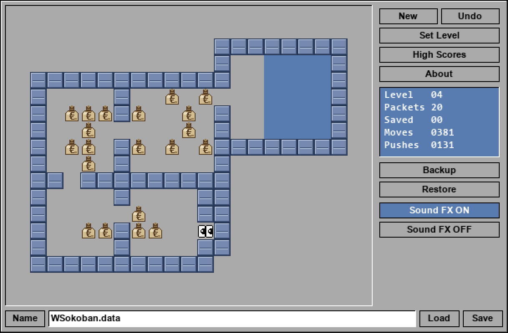

# WSokoban

A Windows port of [xsokoban](https://github.com/andrewcmyers/xsokoban) (1989,
Andrew Myers et al.), styled after the 1993 Amiga port *ASokoban* by
Panagiotis Christias.



A single, portable `WSokoban.exe` (~12 MB) — no install, no DLLs to
drop alongside, no Python on the user's machine. Workbench 2.x look,
two-eyed player who tracks the direction of motion, drawstring-sack
money packets with €, soft shuffling step sound, confetti when you
solve a level.

Comes bundled with the original 91-level xsokoban set, and can import
additional level collections from a file (`.sok`, `.xsb`, `.slc`,
`.txt`) or directly from [letslogic.com](https://www.letslogic.com)
(54,000+ levels across 670+ collections).

## Download

See the [Releases](../../releases) page for the latest `WSokoban.exe`. Drop
it anywhere; it runs in place. Save state and high scores write to the
folder it's in.

## Controls

- **Arrow keys** — walk / push. The eyes track your direction.
- **Buttons on the right panel** (top to bottom):
  - `New` — restart the current level from scratch.
  - `Undo` — undo the last move or push (toggles "clean run" off).
  - `Set Level` — jump to a level number within the active pack.
  - `High Scores` — top-five `(moves, pushes)` per level, with a `*`
    marker for clean runs (no Undo used).
  - `About` — version, credits, currently-active pack.
  - `Backup` / `Restore` — single in-game checkpoint (saved in memory
    only, lost on quit).
  - `Load Level Pack` — import a new pack (file or letslogic.com).
  - `Now Playing: <name>` — click to switch between installed packs.
  - `Sound FX ON` / `Sound FX OFF` — toggle the footstep sound.
- **Bottom row** — `Name` / filename / `Load` / `Save`. The text field
  is the name of the save file; Load and Save read/write it from the
  same directory as the .exe.
- `+` / `-` — toggle 1× through 4× window scale. The window is freely
  resizable; the viewport letter-boxes to keep the aspect ratio.
- `Q` — quit (auto-saves).
- **Ctrl + V** — paste from the clipboard into any focused text
  field (e.g. when entering your letslogic API key).

## Features

- All 91 levels from the xsokoban distribution (the "Original" pack)
- Import unlimited additional level packs from `.sok`, `.xsb`, `.slc`,
  or `.txt` files
- Browse and download from letslogic.com (54k+ levels) via the
  built-in API client
- Per-pack, per-level high scores with a "clean run" flag (no Undo
  used → `*`)
- Confetti burst on solve
- Procedurally synthesised footstep sound (no audio files bundled)
- Resizable window with pixel-perfect integer scaling
- Setting / state persists across runs (`WSokoban.data`,
  `WSokoban.scores`, `WSokoban.settings` next to the exe). Save files
  remember which pack they came from and switch back on load.

## Level packs

Beyond the bundled "Original" 91 levels, you can install any number
of extra level collections.

### Adding packs

Click **Load Level Pack** in the right panel. Two options:

- **From file…** — opens a native Windows file picker. Pick a
  Sokoban level file in any of these formats — WSokoban auto-detects
  which one it is:
  - `.sok` / `.xsb` / `.txt` — plain text in the standard Sokoban
    character set (`#`, `$`, `.`, `@`, `+`, `*`, ` `). Multi-level
    files are split automatically. `Title:` / `Author:` headers and
    `;`-prefixed level titles are recognised.
  - `.slc` — SokobanYASC XML. Levels in `<L>` tags inside `<Level>`
    blocks; the `Id` attribute becomes the level title.
- **letslogic.com…** — paste your API key once and browse 670+
  collections directly from the game. See
  [Using letslogic.com](#using-letslogiccom-54000-levels) below for
  one-time setup.

When a pack is imported it becomes the **active pack** immediately,
and the right-panel button updates to read **Now Playing: \<pack
name\>**.

### Switching packs

Click the **Now Playing: \<name\>** button. A list of all installed
packs opens — click one to highlight it, then Enter or click again to
switch. Set Level, High Scores, and save state all re-scope to the
new pack.

### Where packs live on disk

Each pack is a plain directory under `packs/` next to the .exe:

```
WSokoban.exe
packs/
  25 etudes romantiques oubliees/
    screen.1
    screen.2
    …
    screen.25
    pack.json        ← {"name", "author", "source", "level_count"}
  Some Other Pack/
    …
```

The bundled "Original" 91 levels live inside the .exe itself (under
`screens/`) and don't appear in `packs/`.

To **remove a pack**, close WSokoban and delete its directory. To
**share a pack with someone else**, just send them the directory —
they drop it into their own `packs/` folder.

### Naming collisions

Importing two packs with the same name doesn't overwrite — the
second one gets a `-2`, `-3`, … suffix on disk.

## Using letslogic.com (54,000+ levels)

[letslogic.com](https://www.letslogic.com) hosts over 54,000 Sokoban
levels across 670+ collections, free for personal use. WSokoban can
browse and download them directly, but it needs an API key tied to a
letslogic account. One-time setup, takes about a minute:

1. **Create a free account** at <https://www.letslogic.com>
   (*Register / Login* link, top of the page).
2. **Confirm your email**, then sign in.
3. **Find your API key.** With the account dropdown in the top right,
   open your **Member Preferences** page. The key is a long
   alphanumeric string near the bottom of that page — copy it to the
   clipboard.
4. **In WSokoban,** click **Load Level Pack** in the right panel and
   then **letslogic.com…** in the dialog that appears.
5. **Paste the API key** when prompted (Ctrl+V works in the text
   field). WSokoban stores it locally so you only do this once.
6. The collection browser opens — scroll, pick one, click
   **Download**. It installs as a new pack and WSokoban switches to it
   immediately.

After the first time, clicking **letslogic.com…** goes straight to the
collection browser — no key prompt.

### Where the key is stored

The key lives in plain-text JSON in `WSokoban.settings` next to the
exe — see [Files written next to the exe](#files-written-next-to-the-exe)
below for the full file layout.

**To change or remove the key**, close WSokoban and either:
- edit `WSokoban.settings` and replace the key value, or
- delete `WSokoban.settings` entirely (sound preference and current
  pack reset to defaults; high scores in `WSokoban.scores` are
  untouched).

The next time you click **letslogic.com…**, the key prompt reappears.

### What WSokoban sends to letslogic

WSokoban uses your key only for two read-only POST requests:
- `/api/v1/collections` — to list available collections
- `/api/v1/collection/<id>` — to download a chosen collection's levels

It never submits solutions, scores, or any other data.

### Troubleshooting

- *"Could not reach letslogic.com"* — network or firewall problem.
  WSokoban talks to `https://letslogic.com/api/v1/...` over HTTPS.
- *"No collections returned"* — usually means the API key is missing
  or invalid. Re-check it on your Member Preferences page and update
  `WSokoban.settings` with the correct value.
- *"Bad JSON from server"* — letslogic returned an error page (often
  HTML) instead of JSON. Check the message for an HTTP status hint;
  503 / 502 mean the site is having a moment, try again shortly.

## Files written next to the exe

WSokoban keeps everything in the directory you put the exe in — no
registry entries, no AppData usage:

| Path | Contents |
|---|---|
| `WSokoban.exe` | The game itself, fully self-contained. |
| `WSokoban.data` | Current save state (level, player position, move history, source pack). Auto-written on quit; the *Save* / *Load* gadgets write to this filename by default. |
| `WSokoban.scores` | Per-pack high scores. JSON: `{pack_name: {level: [[moves, pushes, clean], …]}}`. Top 5 per level. |
| `WSokoban.settings` | Persistent preferences. JSON: `{"sound": true, "current_pack": "Original", "letslogic_api_key": "…"}`. Any missing field falls back to a default. |
| `packs/` | Imported level packs. One subdirectory per pack. Delete or move freely. |

To **reset everything** (high scores, packs, key): close WSokoban,
delete the four `WSokoban.*` files and the `packs/` directory.

## Building from source

Requires Python 3.13+ and pygame-ce:

```
python -m pip install pygame-ce pyinstaller pillow
```

To build the single-file exe:

```
build.cmd
```

The build script invokes PyInstaller with the included `WSokoban.spec`. To
get the small (~12 MB) build, download
[UPX](https://upx.github.io/) and place `upx.exe` next to `build.cmd` —
`build.cmd` puts the script directory on `PATH` so PyInstaller's UPX probe
finds it. Without UPX you'll get a ~15 MB build that works just as well.

To run from source without building:

```
python main.py
```

To regenerate the icon from the original Amiga `.info` file (if you have
one):

```
python extract_icon.py path/to/ASokoban.info
```

## Credits

- **Sokoban** — Hiroyuki Imabayashi / Thinking Rabbit, 1981.
- **xsokoban** — Joseph L. Traub, Andrew Myers, and contributors. Public
  domain. The 91 level files in `screens/` come from this project verbatim.
- **ASokoban (Amiga)** — Panagiotis Christias, 1993, Aminet freeware. The
  app icon is extracted from his original `ASokoban.info` Workbench icon.
- **WSokoban** — ITViking-FIN, 2026.

## Licence

WSokoban itself is MIT-licensed (see [LICENSE](LICENSE)). For licences of
bundled libraries (pygame-ce, SDL2, FreeType, etc.) see
[NOTICES.md](NOTICES.md).
